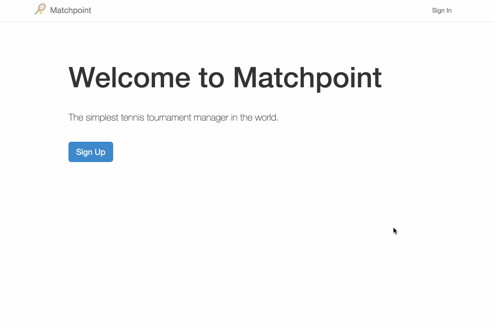
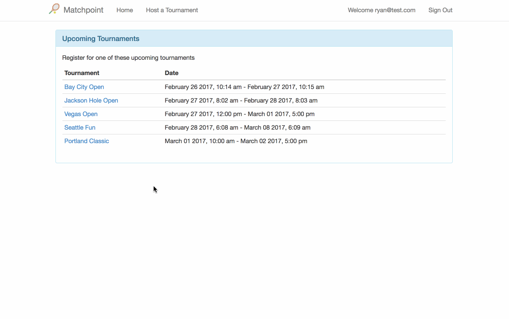
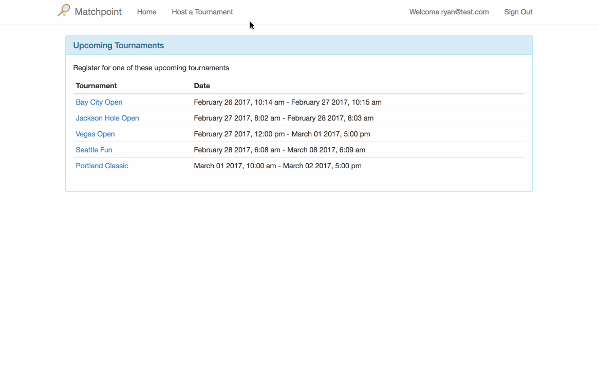
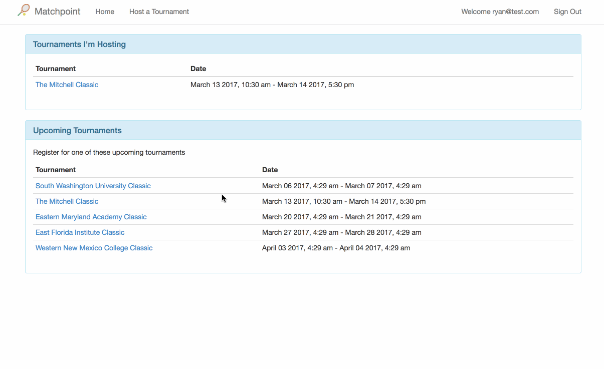

# Matchpoint

Matchpoint is the world's simplest tennis tournament software.

I started this project in Feb 2017. It's a work in progress. Here's a list of
the high level features for the first, very simple, version. Checked features are tested and [demoable](#demos)
in the dev environment (Matchpoint isn't deployed for production yet).

- [x] User management (with [Clearance](https://github.com/thoughtbot/clearance))
- [x] Sign in/out
- [x] Bootstrap theme
- [x] Welcome page
- [x] Home page
- [x] Tournament creation
- [x] Player registration
- [x] Generating round-robin matches 
- [ ] Entering match results
- [ ] Tournament leaderboard

## Local Development

- You'll need at least Ruby 2.2.3
- Matchpoint is built with Rails 5.0.1
- `git clone git@github.com:rydama/matchpoint.git matchpoint`
- `bundle install`
- `bin/rspec`
-  If you want to seed some tournaments, `bin/rails db:seed`
- `bin/rails s`
- Visit http://localhost:3000

# Demos

## Welcome page and sign in

## Registration

## Create tournament

## Generate matches

